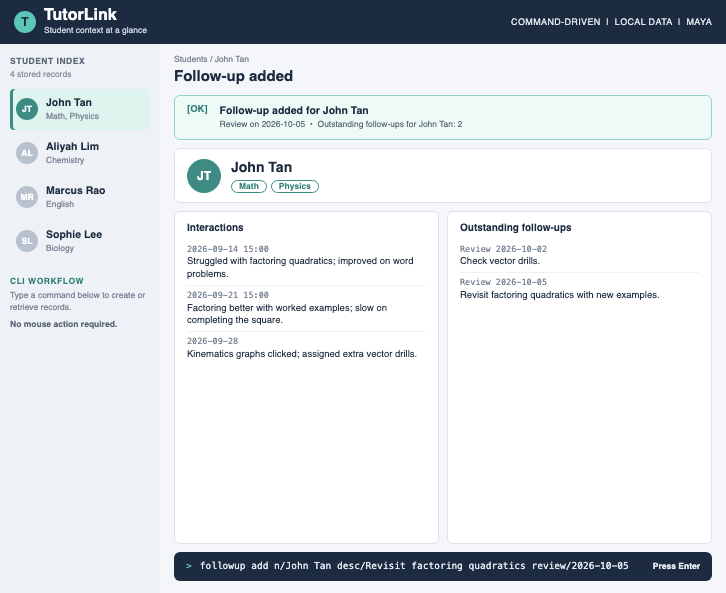

# TutorLink

TutorLink is a desktop app for independent private tutors who teach several students through recurring one-to-one lessons. It is designed for tutors who type quickly and prefer entering commands to using a mouse.

Between lessons, a tutor may need to piece together a student's learning context from chats, documents, and memory. TutorLink aims to keep each student's subjects, dated interaction notes, and outstanding follow-ups in one place, so the tutor can prepare for the next lesson quickly.

## Planned features

TutorLink's first version is planned around six commands:

| Task | Command |
| --- | --- |
| Add a student and their subjects | `student add n/NAME [s/SUBJECT]...` |
| View a student's details | `student view n/NAME` |
| Record an interaction with a note | `interaction add n/NAME d/DATE [t/TIME] note/TEXT` |
| View a student's interaction history | `interaction list n/NAME` |
| Add a follow-up for a student | `followup add n/NAME desc/TEXT review/DATE` |
| View a student's outstanding follow-ups | `followup list n/NAME` |

For example, a tutor could record a lesson with `interaction add n/Alex Tan d/2026-10-01 note/Practised algebraic fractions`, then add `followup add n/Alex Tan desc/Revisit algebraic fractions review/2026-10-08`. Before the next lesson, `student view`, `interaction list`, and `followup list` would help the tutor regain context.

Dates use `yyyy-MM-dd`, and an optional interaction time uses `HH:mm`. Follow-ups belong to a student. Until a command to complete or cancel them is added, every recorded follow-up is considered outstanding.

## Scope

TutorLink is intended for one tutor using a personal computer, with data stored locally. It focuses on student records and lesson context. It does not schedule lessons, generate lesson content, keep a gradebook, manage payments, send messages, or provide accounts for students and guardians.

## Documentation

See the [User Guide](docs/UserGuide.md) for usage details, the [Developer Guide](docs/DeveloperGuide.md) for requirements and design, and the [team page](docs/AboutUs.md) for the people behind TutorLink. These documents are being updated as the app moves from its AddressBook starting point toward the planned TutorLink features.

This project is based on the [AddressBook-Level3 project](https://se-education.org/addressbook-level3/) created by the [SE-EDU initiative](https://se-education.org).
