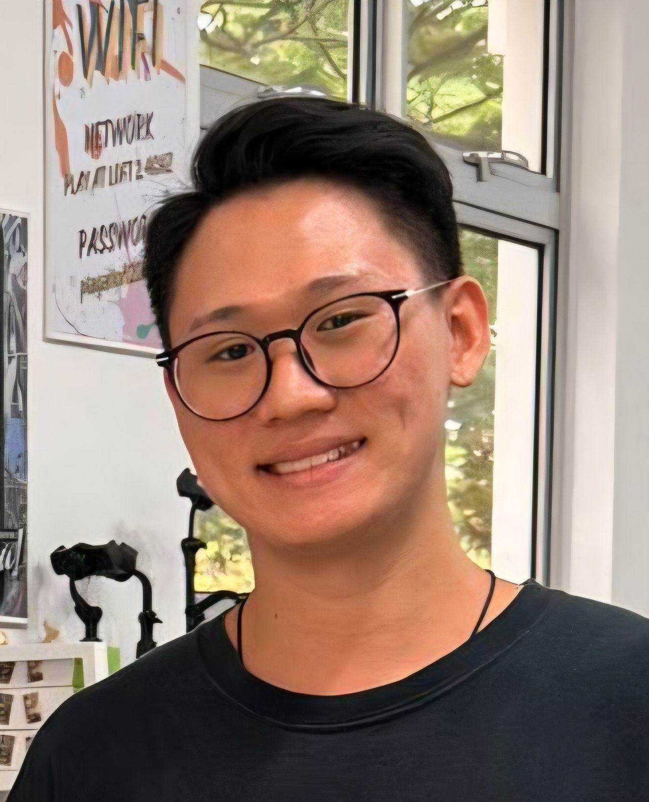
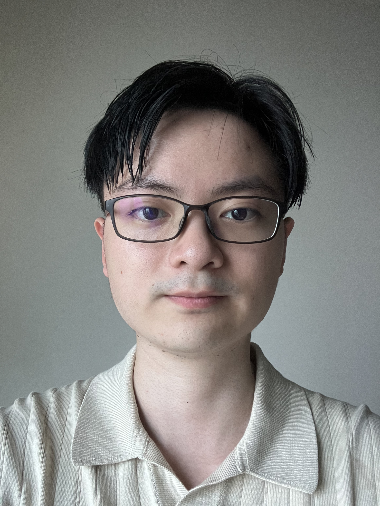

We are a team based in the [School of Computing, National University of Singapore](https://www.comp.nus.edu.sg).

You can reach us at the email `seer[at]comp.nus.edu.sg`

## Project team

### Chia Song Jie

[[github](https://github.com/Soch-ia)]

* Role: Team Lead
* Responsibilities: Overall project coordination, Documentation, Deliverables and deadlines

### Elhanan Neriah Wong

[[github](http://github.com/elhanannw)]

* Role: Quality Assurance
* Responsibilities: Code Quality and Coding Standards, PR Reviewer

### Daniel

[[github](https://github.com/Dancodes2)]

* Role: Tester
* Responsibilities: Smoke Testing, Github Versioning
