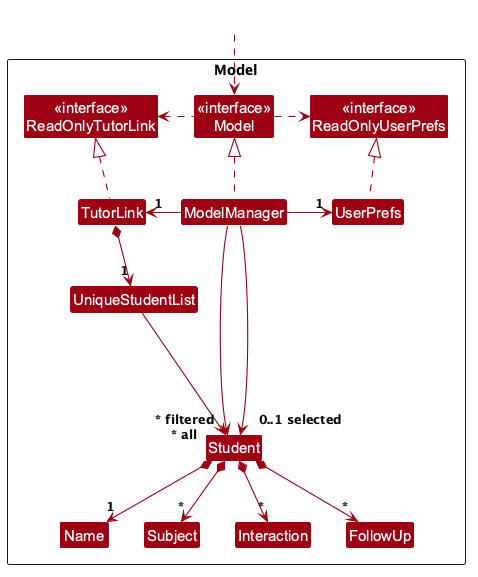
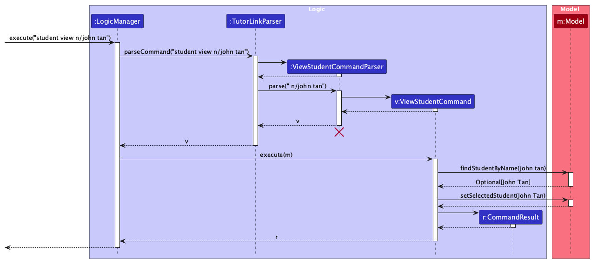

* Table of Contents
{:toc}

--------------------------------------------------------------------------------------------------------------------

## **Acknowledgements**

* _{List the sources of reused or adapted ideas, code, documentation, and third-party libraries here, with links to the originals.}_

--------------------------------------------------------------------------------------------------------------------

## **Setting up, getting started**

Refer to the guide [_Setting up and getting started_](SettingUp.md).

--------------------------------------------------------------------------------------------------------------------

## **Design**

:bulb: **Tip:** The `.puml` files used to create diagrams are in `docs/diagrams`. Refer to the [_PlantUML Tutorial_ at se-edu/guides](https://se-education.org/guides/tutorials/plantUml.html) to learn how to create and edit diagrams.

### Architecture

The ***Architecture Diagram*** given above explains the high-level design of the App.

The following provides a quick overview of the main components and their interactions.

**Main components of the architecture**

**`Main`** (consisting of classes [`Main`](https://github.com/se-edu/addressbook-level3/tree/master/src/main/java/seedu/address/Main.java) and [`MainApp`](https://github.com/se-edu/addressbook-level3/tree/master/src/main/java/seedu/address/MainApp.java)) is in charge of the app launch and shut down.
* At app launch, it initializes the other components in the correct sequence, and connects them up with each other.
* At shut down, it shuts down the other components and invokes cleanup methods where necessary.

The bulk of the app's work is done by the following four components:

* [**`UI`**](#ui-component): The UI of the App.
* [**`Logic`**](#logic-component): The command executor.
* [**`Model`**](#model-component): Holds the data of the App in memory.
* [**`Storage`**](#storage-component): Reads data from, and writes data to, the hard disk.

[**`Commons`**](#common-classes) represents a collection of classes used by multiple other components.

**How the architecture components interact with each other**

The *Sequence Diagram* below shows how the components interact with each other for the scenario where the user issues the command `delete 1`.

Each of the four main components (also shown in the diagram above),

* defines its *API* in an `interface` with the same name as the Component.
* provides its functionality through a concrete `{Component Name}Manager` class that implements the corresponding API interface.

For example, the `Logic` component defines its API in `Logic.java` and implements it in `LogicManager.java`. Other components interact with a component through its interface rather than its concrete class, preventing them from coupling to that component's implementation, as illustrated in the following partial class diagram.

The sections below give more details of each component.

### UI component

The **API** of this component is specified in [`Ui.java`](https://github.com/se-edu/addressbook-level3/tree/master/src/main/java/seedu/address/ui/Ui.java)

The UI consists of a `MainWindow` and its parts, such as `CommandBox`, `ResultDisplay`, `PersonListPanel`, and `StatusBarFooter`. All of these, including `MainWindow`, inherit from the abstract `UiPart` class, which captures common behavior among classes that represent visible GUI parts.

The `UI` component uses the JavaFX UI framework. The layouts of these UI parts are defined in matching `.fxml` files in `src/main/resources/view`. For example, [`MainWindow.fxml`](https://github.com/se-edu/addressbook-level3/tree/master/src/main/resources/view/MainWindow.fxml) specifies the layout of [`MainWindow`](https://github.com/se-edu/addressbook-level3/tree/master/src/main/java/seedu/address/ui/MainWindow.java).

The `UI` component,

* executes user commands using the `Logic` component.
* listens for changes to `Model` data so that the UI can be updated with the modified data.
* keeps a reference to the `Logic` component, because the `UI` relies on the `Logic` to execute commands.
* depends on some classes in the `Model` component because it displays `Person` objects from the model.

### Logic component

**API** : [`Logic.java`](https://github.com/se-edu/addressbook-level3/tree/master/src/main/java/seedu/address/logic/Logic.java)

Here's a (partial) class diagram of the `Logic` component:

The sequence diagram below illustrates the interactions within the `Logic` component, taking `execute("delete 1")` API call as an example.

:information_source: **Note:** The lifeline for `DeleteCommandParser` should end at the destroy marker (X), but due to a limitation of PlantUML, it continues to the end of the diagram.

How the `Logic` component works:

1. When `Logic` is called upon to execute a command, the command is passed to an `AddressBookParser` object, which in turn creates a parser that matches the command (e.g., `DeleteCommandParser`) and uses it to parse the command.
1. This results in a `Command` object (more precisely, an object of one of its subclasses e.g., `DeleteCommand`) which is executed by the `LogicManager`.
1. The command can communicate with the `Model` when it is executed (e.g. to delete a person). 
   Note that although this is shown as a single step in the diagram above for simplicity, the code can require several interactions between the command object and the `Model` to complete the operation.
1. The result of the command execution is encapsulated as a `CommandResult` object which is returned from `Logic`.

Here are the other classes in `Logic` (omitted from the class diagram above) that are used for parsing a user command:

How the parsing works:
* When called upon to parse a user command, the `AddressBookParser` class creates an `XYZCommandParser` (`XYZ` is a placeholder for the specific command name, e.g., `AddCommandParser`). The parser uses the other classes shown above to parse the user command and create an `XYZCommand` object (e.g., `AddCommand`). The `AddressBookParser` returns that object as a `Command` object.
* All `XYZCommandParser` classes, such as `AddCommandParser` and `DeleteCommandParser`, implement the `Parser` interface so they can be treated similarly where appropriate, for example during testing.

### Model component
**API** : [`Model.java`](https://github.com/AY2627S1-CS2103-F12-2/tp/tree/master/src/main/java/seedu/tutorlink/model/Model.java)

The `Model` component,

* stores TutorLink's data, i.e. all `Student` objects, which are kept in a `UniqueStudentList`.
* stores each student's records inside the `Student` itself. A `Student` has a `Name`, any number of `Subject`s, and lists of `Interaction`s and `FollowUp`s, which keep the order they were added in.
* keeps every `Student` immutable. Recording an interaction or follow-up creates an updated copy (e.g. `Student#withInteraction`), and the command swaps it in with `Model#setStudent`.
* stores the `Student` objects matched by the current filter (e.g. the result of `find`) in a separate _filtered_ list. It exposes this as an unmodifiable `ObservableList<Student>` that the UI observes, so the student list updates when the filter changes.
* stores the _selected_ student, i.e. the one whose details, interactions and follow-ups are shown, as a `ReadOnlyObjectProperty<Student>` that the UI panels observe. The selection follows the student when they are updated, and is cleared when they are deleted or hidden by a filter.
* finds students by name with `Model#findStudentByName`, which matches names ignoring case and extra spaces (see [Finding a student by name](#finding-a-student-by-name)).
* stores a `UserPrefs` object that represents the user's preferences (currently, just the GUI settings). This is exposed to the outside as a `ReadOnlyUserPrefs` object.
* does not depend on any of the other three components (as the `Model` represents data entities of the domain, they should make sense on their own without depending on other components)

### Storage component

**API** : [`Storage.java`](https://github.com/se-edu/addressbook-level3/tree/master/src/main/java/seedu/address/storage/Storage.java)

The `Storage` component,
* can save both address book data and user preference data in JSON format, and read them back into corresponding objects.
* is implemented by `StorageManager`, which delegates the actual JSON file access to `JsonAddressBookStorage` and `JsonUserPrefsStorage` (one class per data file).
* depends on some classes in the `Model` component (because the `Storage` component's job is to save/retrieve objects that belong to the `Model`)

### Common classes

Classes used by multiple components are in the `seedu.address.commons` package.

--------------------------------------------------------------------------------------------------------------------

## **Implementation**

This section describes some noteworthy details on how certain features are implemented.

### Finding a student by name

Every command that works on one student (`student view`, `student delete`, `interaction add`, `followup add` and so on) identifies the student by name with `n/NAME`, not by a list index. They all use the same lookup, `Model#findStudentByName(Name)`, and show the same error when no student matches.

The sequence diagram below shows how `student view n/john tan` finds and selects the student `John Tan`.

:information_source: **Note:** The lifeline for `ViewStudentCommandParser` should end at the destroy marker (X), but due to a limitation of PlantUML, it continues to the end of the diagram.

1. `TutorLinkParser` reads the command word `student view` and passes the rest of the input to a new `ViewStudentCommandParser`.
1. `ViewStudentCommandParser` checks that exactly one `n/` prefix is present and turns its value into a `Name`, which rejects names that break the naming rules. It returns a `ViewStudentCommand` holding that `Name`.
1. When executed, `ViewStudentCommand` calls `Model#findStudentByName`. This compares names with `Name#isSameName`, which ignores case and treats runs of spaces as one space, so `john   TAN` finds `John Tan`.
1. If a student is found, the command calls `Model#setSelectedStudent`. The UI panels observe the selected student, so they show John Tan's details, interactions and follow-ups. If no student is found, the command throws a `CommandException` with `No student named 'john tan' found.` and nothing changes.

Names are unique in the same way. `UniqueStudentList` treats two students as duplicates when `Student#isSameStudent` is true, which also uses `Name#isSameName`. So `student add n/john tan` is rejected when `John Tan` exists, and a name lookup can never match two students.

`Name#equals` still compares names exactly, because it decides whether two `Student` records hold identical data (e.g. in tests), not whether they are the same person. The stored name keeps the casing the tutor first typed.

#### Design considerations

**Aspect: How a command identifies a student**

* **Alternative 1 (current choice):** By name, e.g. `student view n/John Tan`.
  * Pros: The tutor already knows each student's name, so no list lookup is needed first. A command means the same thing whatever the list shows, so a filter cannot make it act on the wrong student.
  * Cons: Names must be unique, so two students with the same name need distinguishing names (e.g. `John Tan Jr.`). Long names take longer to type.
* **Alternative 2:** By list index, as in AB3's `delete 1`.
  * Pros: Short to type.
  * Cons: The same index refers to different students after `find`, so a tutor can easily act on the wrong student. The tutor must look at the list before every command.

**Aspect: How names are compared**

* **Alternative 1 (current choice):** Ignoring case and extra spaces.
  * Pros: Real names are not case-sensitive, so `john tan` and `John Tan` should be the same student. It also prevents accidental near-duplicates.
  * Cons: Two genuinely different students whose names differ only in case cannot both be stored. This is very unlikely for one tutor.
* **Alternative 2:** Exactly as typed.
  * Pros: Simplest to implement.
  * Cons: The tutor must remember the exact casing, and `john tan` could be added as a second record of the same student.

### Two-word command words

TutorLink's command words name a domain and then an action, e.g. `student add`, `interaction list` and `followup add`. A few app-level commands (`help`, `list`, `find`, `exit`) are one word.

`TutorLinkParser` splits the input into a command word and arguments with one regular expression. The command word is an optional domain (`student`, `interaction` or `followup`) followed by one more word. Matching is case-insensitive, and the command word is normalised to lower case with single spaces before it is compared with each command's `COMMAND_WORD`. So `Student   ADD n/John Tan` is read as `student add` with the arguments ` n/John Tan`.

A domain followed by an unknown action, such as `student fly`, gives `Unknown command.`, the same as any other unknown command.

#### Design considerations

**Aspect: Command word format**

* **Alternative 1 (current choice):** `<domain> <action>`, e.g. `student add`.
  * Pros: Commands are predictable. Knowing `student add` and `interaction list` suggests `interaction add`. The same action word can be reused for each kind of record without clashing.
  * Cons: One more word to type than a single-word command.
* **Alternative 2:** One word per command, e.g. `addstudent` or `addinteraction`.
  * Pros: Shorter to type.
  * Cons: Harder to remember and to guess, and the names get long as the number of record types grows.

### \[Proposed\] Undo/redo feature

#### Proposed Implementation

The proposed undo/redo mechanism is facilitated by `VersionedAddressBook`. It extends `AddressBook` with an undo/redo history, stored internally as an `addressBookStateList` and `currentStatePointer`. Additionally, it implements the following operations:

* `VersionedAddressBook#commit()` — Saves the current address book state in its history.
* `VersionedAddressBook#undo()` — Restores the previous address book state from its history.
* `VersionedAddressBook#redo()` — Restores a previously undone address book state from its history.

These operations are exposed in the `Model` interface as `Model#commitAddressBook()`, `Model#undoAddressBook()` and `Model#redoAddressBook()` respectively.

Given below is an example usage scenario and how the undo/redo mechanism behaves at each step.

Step 1. The user launches the application for the first time. The `VersionedAddressBook` will be initialized with the initial address book state, and the `currentStatePointer` pointing to that single address book state.

Step 2. The user executes `delete 5` command to delete the 5th person in the address book. The `delete` command calls `Model#commitAddressBook()`, causing the modified state of the address book after the `delete 5` command executes to be saved in the `addressBookStateList`, and the `currentStatePointer` is shifted to the newly inserted address book state.

Step 3. The user executes `add n/David …​` to add a new person. The `add` command also calls `Model#commitAddressBook()`, causing another modified address book state to be saved into the `addressBookStateList`.

:information_source: **Note:** If a command fails its execution, it will not call `Model#commitAddressBook()`, so the address book state will not be saved into the `addressBookStateList`.

Step 4. The user now decides that adding the person was a mistake, and decides to undo that action by executing the `undo` command. The `undo` command will call `Model#undoAddressBook()`, which will shift the `currentStatePointer` once to the left, pointing it to the previous address book state, and restores the address book to that state.

:information_source: **Note:** If the `currentStatePointer` is at index 0, pointing to the initial AddressBook state, then there are no previous AddressBook states to restore. The `undo` command uses `Model#canUndoAddressBook()` to check if this is the case. If so, it will return an error to the user rather
than attempting to perform the undo.

The following sequence diagram shows how an undo operation goes through the `Logic` component:

:information_source: **Note:** The lifeline for `UndoCommand` should end at the destroy marker (X), but due to a limitation of PlantUML, it continues to the end of the diagram.

Similarly, how an undo operation goes through the `Model` component is shown below:

The `redo` command does the opposite — it calls `Model#redoAddressBook()`, which shifts the `currentStatePointer` once to the right, pointing to the previously undone state, and restores the address book to that state.

:information_source: **Note:** If the `currentStatePointer` is at index `addressBookStateList.size() - 1`, pointing to the latest address book state, then there are no undone AddressBook states to restore. The `redo` command uses `Model#canRedoAddressBook()` to check if this is the case. If so, it will return an error to the user rather than attempting to perform the redo.

Step 5. The user then decides to execute the command `list`. Commands that do not modify the address book, such as `list`, will usually not call `Model#commitAddressBook()`, `Model#undoAddressBook()` or `Model#redoAddressBook()`. Thus, the `addressBookStateList` remains unchanged.

Step 6. The user executes `clear`, which calls `Model#commitAddressBook()`. Since the `currentStatePointer` is not pointing at the end of the `addressBookStateList`, all address book states after the `currentStatePointer` will be purged. Reason: It no longer makes sense to redo the `add n/David …​` command. This is the behavior that most modern desktop applications follow.

The following activity diagram summarizes what happens when a user executes a new command:

#### Design considerations:

**Aspect: How undo & redo execute:**

* **Alternative 1 (current choice):** Saves the entire address book.
  * Pros: Easy to implement.
  * Cons: May have performance issues in terms of memory usage.

* **Alternative 2:** Individual command knows how to undo/redo by
  itself.
  * Pros: Will use less memory (e.g. for `delete`, just save the person being deleted).
  * Cons: We must ensure that the implementation of each individual command is correct.

_{more aspects and alternatives to be added}_

### \[Proposed\] Data archiving

_{Explain here how the data archiving feature will be implemented}_

--------------------------------------------------------------------------------------------------------------------

## **Documentation, logging, testing, dev-ops**

* [Documentation guide](Documentation.md)
* [Testing guide](Testing.md)
* [Logging guide](Logging.md)
* [DevOps guide](DevOps.md)

--------------------------------------------------------------------------------------------------------------------

## **Appendix: Requirements**

### Product scope

**Target user profile**:

* is an independent private tutor who teaches several students through recurring one-to-one lessons
* works alone and keeps records on a personal computer
* needs to remember each student's learning context between lessons, often with only a few minutes to prepare
* currently relies on a mix of notes, chat histories, documents and memory
* can type fast and prefers typing to mouse interactions
* is reasonably comfortable using CLI apps

**Value proposition**: TutorLink gives private tutors quick access to each student's subjects, dated interaction notes and outstanding follow-ups, so that they can regain context before a lesson and provide consistent, personalised guidance through a fast CLI workflow.

TutorLink is a single-user app. It does not schedule or plan lessons, keep a gradebook, manage fees or payments, send messages to students or guardians, or provide student or guardian accounts.

### User stories

Priorities: High (must have) - `* * *`, Medium (nice to have) - `* *`, Low (unlikely to have) - `*`

| Priority | ID | As a …​ | I can …​ | So that …​ |
| -------- | -- | ------ | ------- | ---------- |
| `* * *` | US03 | private tutor | record a student | I can maintain information about the tutoring relationship |
| `* * *` | US04 | private tutor | view a student’s details | I can recall essential information about them |
| `* * *` | US13 | private tutor | record the subjects I teach a student | their learning context is clear |
| `* * *` | US21 | private tutor | record a dated interaction with a student | the tutoring relationship has a chronological history |
| `* * *` | US24 | private tutor | record a concise interaction note | I can remember what happened |
| `* * *` | US28 | private tutor | view a student’s interactions chronologically | I can understand how the tutoring relationship has developed |
| `* * *` | US33 | private tutor | create a follow-up for a student | something I intend to revisit is not forgotten |
| `* * *` | US34 | private tutor | describe what a follow-up requires | I understand the intended action later |
| `* * *` | US35 | private tutor | give a follow-up a date for review | I know when it should receive attention |
| `* * *` | US39 | private tutor | view outstanding follow-ups for one student | I can prepare for their next session |
| `* * *` | US53 | fast typist | perform frequent actions efficiently using the keyboard | record-keeping does not disrupt my work |
| `* *` | US05 | private tutor | correct a student’s details | inaccurate information does not persist |
| `* *` | US08 | privacy-conscious tutor | permanently remove a student’s record | information is not retained unnecessarily |
| `* *` | US09 | busy tutor | find a student using partial information | I can retrieve their context quickly |
| `* *` | US15 | private tutor | record a current learning need | I remember where the student requires support |
| `* *` | US17 | private tutor | mark a learning need as resolved | completed needs do not remain current |
| `* *` | US18 | private tutor | record a qualitative progress observation | I can recognise how the student is developing |
| `* *` | US29 | private tutor | correct an interaction record | mistakes do not remain in the history |
| `* *` | US30 | private tutor | remove an incorrect interaction | false information does not affect future guidance |
| `* *` | US36 | private tutor | mark a follow-up as completed or cancelled | only relevant items remain outstanding |
| `* *` | US42 | private tutor preparing for a lesson | view the student’s recent progress, current needs, and open follow-ups together | I can regain context quickly |
| `* *` | US43 | private tutor | view a student’s most recent interaction | I can recall where the previous session ended |
| `* *` | US57 | tutor teaching multiple students | view the students I currently tutor | I can quickly identify whose context I need |
| `*` | US01 | potential user | explore sample student records | I can understand how TutorLink may fit my work |
| `*` | US02 | tutor ready to enter real data | remove the sample records | they are not mixed with my actual students |
| `*` | US06 | private tutor | archive a former student | inactive relationships do not clutter my current work |
| `*` | US07 | private tutor | restore an archived student | I can resume the relationship if tutoring restarts |
| `*` | US10 | private tutor | record a student’s contact details | essential contact information is kept with the relationship |
| `*` | US11 | private tutor | record a student’s guardian contact, kept separate from the student’s own details | I know whom to contact when necessary |
| `*` | US14 | private tutor | record a student’s current learning goals | my guidance remains aligned with those goals |
| `*` | US16 | private tutor | indicate which learning needs currently deserve the most attention | I can prioritise them |
| `*` | US20 | long-term tutor | retain previous learning needs and observations | changes over time are not lost |
| `*` | US22 | private tutor | identify the type of interaction | I can distinguish tutoring sessions from other discussions |
| `*` | US23 | private tutor | associate an interaction with a subject or topic | its academic context is clear |
| `*` | US25 | private tutor | record an observed strength | positive progress is not overlooked |
| `*` | US26 | private tutor | record an observed difficulty | it can be revisited later |
| `*` | US27 | private tutor | associate relevant observations with the interaction that produced them | their context is preserved |
| `*` | US31 | long-time tutor | search previous interaction notes | I can retrieve details I only partially remember |
| `*` | US32 | tutor teaching multiple subjects | view interactions relating to one subject or topic | unrelated history does not distract me |
| `*` | US37 | private tutor | postpone a follow-up | its timing reflects the student’s changing circumstances |
| `*` | US38 | busy tutor | view outstanding follow-ups across all students | I know what needs attention |
| `*` | US40 | forgetful tutor | identify overdue follow-ups | missed items can be recovered |
| `*` | US41 | private tutor | trace a follow-up to the interaction that created it | I understand why it exists |
| `*` | US44 | private tutor | view unresolved learning needs | ongoing difficulties are not overlooked |
| `*` | US45 | tutor with many students | identify which student records were updated recently | I can orient myself after a busy period |
| `*` | US46 | tutor returning after a break | see when learning information was last updated | I can judge whether it may be stale |
| `*` | US47 | private tutor | consolidate duplicate student records | a student’s history is not fragmented |
| `*` | US48 | tutor migrating from another system | bring in existing student information | I do not need to re-enter everything |
| `*` | US49 | private tutor | export appropriate student records | I can retain a usable copy outside TutorLink |
| `*` | US51 | tutor concerned about data loss | back up and restore my records | accidental loss does not destroy the tutoring history |
| `*` | US56 | long-term tutor | view only a student’s most recent interactions by default, with older ones on request | I can regain relevant context without going through old history |
| `*` | US58 | tutor teaching multiple students | distinguish between students with similar identifying information | I do not confuse one student’s learning context with another’s |
| `*` | US59 | busy tutor | see outstanding follow-ups sorted by review date, with overdue ones flagged | I can deal with the most pressing items first |
| `*` | US62 | privacy-conscious tutor | review the information I have retained about a student | I can identify information I no longer need to keep |

The IDs follow the team's original list of 62 stories. The following IDs were reviewed and are not listed above:

* US12, US19, US55, US60 and US61 were merged into other stories (US11, US42, US17/US46, US43/US46 and US42 respectively).
* US50, US52 and US54 describe system qualities rather than user actions, and are covered by the non-functional requirements below.

### Use cases

(For all use cases below, the **System** is the `TutorLink` and the **Actor** is the `Tutor`, unless specified otherwise)

**Use case: Delete a person**

**MSS**

1.  User requests to list persons
2.  TutorLink shows a list of persons
3.  User requests to delete a specific person in the list
4.  TutorLink deletes the person

    Use case ends.

**Extensions**

* 2a. The list is empty.

  Use case ends.

* 3a. The given index is invalid.

    * 3a1. TutorLink shows an error message.

      Use case resumes at step 2.

**Use case: Add a follow-up for a student**

**MSS**

1.  Tutor requests to add a follow-up for a student, providing a description and a review date.
2.  TutorLink finds the student and validates the description and review date.
3.  TutorLink adds the follow-up to the student's record.
4.  TutorLink confirms that the follow-up was added.

    Use case ends.

**Extensions**

* 2a. No student matches the given name.

    * 2a1. TutorLink shows an error message.

      Use case ends without changing any stored data.

* 2b. The description is empty or the review date is invalid.

    * 2b1. TutorLink shows an error message.

      Use case ends without changing any stored data.

**Use case: View a student's follow-ups**

**MSS**

1.  Tutor requests to view the outstanding follow-ups of a specific student.
2.  TutorLink finds the student.
3.  TutorLink retrieves the student's outstanding follow-ups.
4.  TutorLink shows each follow-up's description and review date.

    Use case ends.

**Extensions**

* 1a. The tutor does not identify a student.

    * 1a1. TutorLink shows an error message.

      Use case ends.

* 2a. No student matches the given name.

    * 2a1. TutorLink shows an error message.

      Use case ends.

* 3a. The student has no follow-ups.

    * 3a1. TutorLink tells the tutor that no follow-ups were found for the student.

      Use case ends.

**Use case: Record an interaction with a student**

**MSS**

1.  Tutor requests to record an interaction, identifying the student and providing an interaction date, an optional time, and a concise note.
2.  TutorLink records the interaction in the student's interaction history.
3.  TutorLink confirms that the interaction was recorded.

    Use case ends.

**Extensions**

* 1a. No student matches the specified name.

    * 1a1. TutorLink informs the tutor that no matching student was found.

      Use case ends without changing any stored data.

* 1b. The supplied interaction details are incomplete or invalid.

    * 1b1. TutorLink informs the tutor what is wrong and how to correct the input.

      Use case ends without changing any stored data.

**Use case: View a student's interaction history**

**MSS**

1.  Tutor requests to view a student's interaction history, identifying the student.
2.  TutorLink shows the student's interactions in chronological order, including each interaction's date, optional time, and concise note.

    Use case ends.

**Extensions**

* 1a. The tutor does not identify a student.

    * 1a1. TutorLink informs the tutor how to correct the request.

      Use case ends.

* 1b. No student matches the specified name.

    * 1b1. TutorLink informs the tutor that no matching student was found.

      Use case ends.

* 2a. The student has no interactions.

    * 2a1. TutorLink informs the tutor that the student has no interactions.

      Use case ends.

*{More to be added}*

### Non-Functional Requirements

1.  Should work on any _mainstream OS_ as long as it has Java `25` or above installed.
2.  Should be usable by a single user on one computer, with no account, login or network connection required.
3.  Should save all data locally in a human-editable file after every command that changes data, so that no data is lost when the app is closed (US50, US52).
4.  Should be able to hold up to 100 students, each with up to 200 interactions and 50 follow-ups, and still respond to any command within 2 seconds on a typical laptop (US54).
5.  A user with above average typing speed for regular English text (i.e. not code, not system admin commands) should be able to accomplish every frequent task faster using commands than using the mouse (US53).
6.  Should be distributed as a single JAR file of at most 100MB that runs without an installer.
7.  Should show an error message for every invalid command that states what is wrong and the expected command format, without changing any stored data.
8.  Should display text readably on screens with a resolution of 1920x1080 or higher, at 100% and 125% screen scale.

### Glossary

* **Mainstream OS**: Windows, Linux, Unix, or macOS
* **Student**: A person the tutor teaches, identified in TutorLink by their name (case-insensitive and unique). Interactions and follow-ups are always recorded against a student.
* **Follow-up**: A note describing something the tutor intends to revisit with a student. Each follow-up belongs to a student, rather than to a particular interaction, and has a description and a review date.
* **Review date**: The date on which the tutor intends to review a follow-up, in `yyyy-MM-dd` format. It is not necessarily the date of a lesson.
* **Outstanding follow-up**: A follow-up that has not been completed or cancelled. Until TutorLink supports completing or cancelling follow-ups, every recorded follow-up is outstanding.
* **Interaction**: A dated record of a lesson or other discussion with a student. Each interaction belongs to exactly one student and contains a concise note and, optionally, a time.
* **Interaction date**: The date on which an interaction occurred, in `yyyy-MM-dd` format.
* **Concise note**: Brief text recorded with an interaction to summarise what happened.

--------------------------------------------------------------------------------------------------------------------

## **Appendix: Instructions for manual testing**

Given below are instructions to test the app manually.

:information_source: **Note:** These instructions only provide a starting point for testers to work on;
testers are expected to do more *exploratory* testing.

### Launch and shutdown

1. Initial launch

   1. Download the JAR file and copy it into an empty folder.

   1. Double-click the JAR file. 
      Expected: The GUI opens with a set of sample students. The window size may not be optimal.

1. Saving window preferences

   1. Resize the window to an optimal size. Move the window to a different location. Close the window.

   1. Relaunch the app by double-clicking the JAR file. 
       Expected: The most recent window size and location are retained.

1. _{ more test cases …​ }_

### Adding a student

1. Adding a new student

   1. Test case: `student add n/John Tan s/Math s/Physics` 
      Expected: John Tan appears at the bottom of the student list with subjects Math and Physics, and is shown in the detail panel. The result shows `✔ Student added: John Tan (subjects: Math, Physics)` and the new total.

   1. Test case: `student add n/Aliyah Lim` 
      Expected: Aliyah Lim is added with no subjects.

1. Adding a duplicate or invalid student

   1. Prerequisites: John Tan exists.

   1. Test case: `student add n/john tan` 
      Expected: No student is added. The error says a student named `John Tan` already exists.

   1. Test case: `student add n/John Tan s/Math s/math` 
      Expected: No student is added. The error says the subject is specified twice.

   1. Other incorrect commands to try: `student add`, `student add n/`, `student add n/12345`, `student add n/Ann s/Math/Physics` 
      Expected: No student is added. The error explains which value is wrong, or shows the correct command format.

### Viewing a student

1. Prerequisites: John Tan exists.

1. Test case: `student view n/JOHN   tan` 
   Expected: John Tan's name and subjects are shown in the result and the detail panel. His interactions and follow-ups are shown in the panels below.

1. Test case: `student view n/Nobody Here` 
   Expected: The error says no student named `Nobody Here` is found. The panels do not change.

1. Test case: `student view John Tan` 
   Expected: The error shows the correct command format.

### Deleting a student

1. Prerequisites: John Tan exists, has at least one interaction, and is shown in the detail panel (`student view n/John Tan`).

1. Test case: `student delete n/john tan` 
   Expected: John Tan disappears from the student list, and the detail, interaction and follow-up panels go back to their placeholders. The result shows `✔ Student deleted: John Tan` and the new total.

1. Test case: `interaction list n/John Tan` 
   Expected: The error says no student named `John Tan` is found, because his interactions were deleted with him.

1. Other incorrect commands to try: `student delete`, `student delete 1`, `student delete n/Nobody Here` 
   Expected: No student is deleted. The error shows the correct command format, or says no such student is found.

### Saving data

1. Data is kept after a restart

   1. Add a student and an interaction, then close TutorLink with `exit`.

   1. Relaunch TutorLink. 
      Expected: The student and the interaction are still there.

1. Dealing with a missing data file

   1. Close TutorLink and delete `data/tutorlink.json` in the folder containing the JAR file.

   1. Relaunch TutorLink. 
      Expected: TutorLink starts with the sample students.

1. Dealing with a corrupted data file

   1. Close TutorLink. Open `data/tutorlink.json` in a text editor and break it, e.g. delete the closing `}` or change a student's `"name"` to `"12345"`.

   1. Relaunch TutorLink. 
      Expected: TutorLink starts with no students, and the corrupted file is left on disk until the next command that changes data overwrites it.
